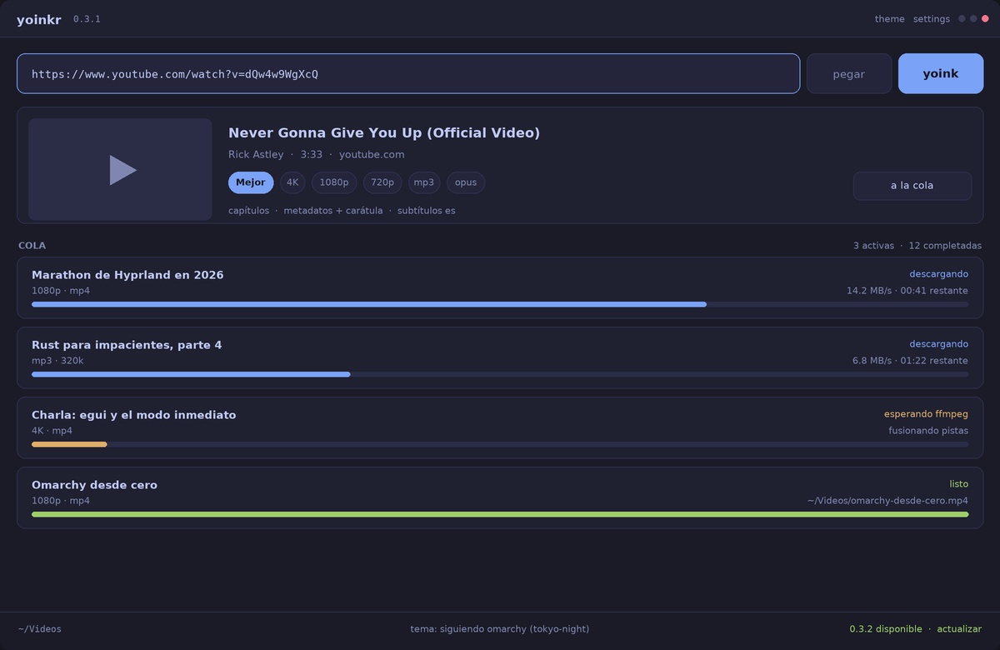

# reel

Pegas un enlace, elegis un formato, y la cola hace el resto.

Una app de escritorio nativa para descargar video y audio, construida con
[egui](https://github.com/emilk/egui) sobre [fastframe](https://fastframe.dev).
El trabajo pesado lo hace [yt-dlp](https://github.com/yt-dlp/yt-dlp), que
soporta 1800 y pico de sitios, asi que esto no es solo YouTube.

> Estado: esqueleto avanzado. La interfaz, el cableado de fastframe, el panel de
> ajustes y la cola concurrente estan puestos y probados contra yt-dlp de
> verdad. Todavia no hay releases.

Tutoriales con capturas reales de la ventana: [`docs/`](docs/README.md).

## Estado

Que esta hecho, que falta, y que conviene saber antes de tocar. Pensado para
quien siga con esto, sea una persona u otro agente.

### Hecho y verificado

Cada punto se comprobo de alguna forma concreta, no solo compilando.

- **La cola baja hasta tres a la vez**, cada trabajo en su hilo, con tope
  (`MAX_CONCURRENTES`). Verificado con el yt-dlp de mentira: tres trabajos
  arrancan en el mismo milisegundo y el total es 2.9s contra 4.4s en serie.
- **El estado de la fila no miente**: nace en `en espera` y pasa a
  `descargando` recien cuando yt-dlp arranca. Antes se mandaba `descargando` al
  encolar y la segunda fila mentia con 0%.
- **Cancelar mata el proceso** y deja `cancelado`. Verificado: 25ms y el hijo
  muerto.
- **Reintentar reanuda** el `.part` en vez de empezar de cero. Medido contra
  yt-dlp real: `[download] Resuming download at byte 14752392`.
- **`volver a bajar`** arregla un archivo truncado, que `reintentar` no puede
  porque yt-dlp saltea un archivo que existe. Medido: 16 -> 11233 bytes.
- **El postprocesado se detecta por el aviso estructurado** de yt-dlp
  (`postprocess:`), no adivinando sus textos. Ojo: **esos avisos van por
  stderr**, y leer solo stdout fue un bug que dejo la deteccion sin funcionar.
- **El panel de ajustes** guarda carpeta, formato, plantilla, cookies,
  subtitulos y tema en `~/.config/reel/settings.json`, y el formato y el tema
  se reponen al arrancar.
- **Las listas se expanden a una fila por video**, con `--flat-playlist`.
  Verificado con una lista real de 19 videos.
- **Una sola instancia**: la segunda le pasa su pedido a la que corre. Sin esto
  dos copias peleaban por el icono de bandeja y por `app.ron`.
- **Avisa al terminar la cola** por `notify-send`.
- **Al arrancar revisa las dos herramientas** que necesita, cada una en su
  hilo: `yt-dlp`, sin el que no hay descargas, y `ffmpeg`, sin el que no se unen
  pistas ni se extrae audio. Si andan, el pie muestra las versiones; si falta
  alguna, avisa en ambar nombrando **esa** herramienta. Verificado apuntando
  `REEL_FFMPEG` y `REEL_YTDLP` a rutas que no existen.
- **Vive sin ventana**: con `--start-hidden` no abre ninguna y la cola baja
  igual, con lo que el proceso puede quedarse de fondo. Verificado.
- **La persistencia del tamano de ventana** funciona: verificado en flotante,
  1400x900 se repone. En mosaico no se nota porque manda el compositor.
- **Limpieza y organizacion de la cola**: botón `limpiar terminadas` en la
  cabecera para remover de un clic todos los trabajos finalizados, cancelados o
  fallados, y acción `quitar` en cada fila inactiva para despejar la lista.
- **Abrir archivo vs abrir carpeta**: en videos y audios descargados, `abrir`
  lanza el archivo directamente en el reproductor del sistema (`xdg-open`) y
  `carpeta` abre el directorio contenedor. En filas resumen de listas de
  reproducción, abre directo la carpeta de descarga configurada sin fallar.
- **Estimación de duración y tamaño**: la ficha calcula la duración y peso
  estimado de videos y de listas completas (ej. `19 videos · 3h 45m (~4.2 GB)`).
- **Confirmación inteligente de dos toques**: para evitar descargas masivas
  accidentales, se pide confirmación si la lista tiene **10 o más videos** o si el
  tamaño estimado alcanza o supera **1 GB**.
- **Subtítulos automáticos de respaldo**: soporte para `--write-auto-subs` junto a
  `--write-subs`, para incrustar subtítulos generados automáticamente si no hay
  pistas manuales disponibles en los idiomas elegidos.
- **Atajos de teclado**: `Ctrl+,` (ajustes), `Ctrl+Q` (salir), `Ctrl+L` (enfocar enlace),
  `Escape` (cerrar ajustes o limpiar enlace/ficha) y `Ctrl+V` (pegar y buscar automáticamente).
- **Filtros interactivos de cola**: cuando hay varios trabajos, la cabecera ofrece
  filtros instantáneos (`todas`, `activas`, `listas`, `con error`), facilitando
  seguir descargas en listas de decenas de elementos.
- **Cancelación sin carreras en cola**: los trabajos cancelados mientras esperan
  cupo de concurrencia se detienen limpiamente y nunca pisan su estado con `descargando`.
- **Pruebas de interfaz automatizadas (headless)**: la UI se prueba de extremo a
  extremo sin necesidad de pantalla ni herramientas externas mediante
  `egui::Context::run_ui`, validando atajos, confirmaciones y renderizado de
  componentes.
- **Formato de audio m4a (AAC)**: opción para descargar y extraer audio en `.m4a`
  manteniendo la pista AAC original de los servidores sin pérdida por transcodificación.
- **Importación por lotes de enlaces**: al pegar múltiples URLs a la vez en la caja
  de texto (separadas por saltos de línea), se encolan automáticamente en lote.
- **Arrastrar y soltar archivos**: se pueden arrastrar archivos de texto (`.txt`)
  con listas de URLs directamente sobre la ventana de Reel para encolarlas todas al instante.
- **Copiar ruta y copiar error**: acción rápida `copiar ruta` en descargas completadas
  y `copiar error` en descargas fallidas (tanto en la cola como en la ficha), copiando
  tanto al portapapeles de la interfaz como al del sistema operativo (`wl-copy`).
- **Vista previa completa de títulos**: pasar el cursor sobre cualquier título
  recortado en la ficha o en las filas de la cola muestra el nombre completo en un tooltip.
- **Límite de velocidad configurable (`--limit-rate`)**: ajuste persistente para limitar el
  ancho de banda de yt-dlp con botones rápidos (`sin límite`, `1 MB/s`, `2 MB/s`, `5 MB/s`, `10 MB/s`)
  o cualquier valor personalizado (ej. `500K`, `3M`), ideal para no saturar la red durante videollamadas o juegos.
- **Plantillas predefinidas de nombres de archivo**: botones de un toque en ajustes para
  cambiar entre los esquemas de nombrado más frecuentes (`estándar`, `con canal/autor`, `numerado`,
  `fecha y título`) sin tener que consultar la documentación de yt-dlp.
- **Buscador interactivo en la cola**: cuando hay más de tres descargas, la cabecera muestra
  un campo de búsqueda para filtrar la lista en tiempo real por título o URL; se limpia al instante
  con un clic en la cruz o pulsando `Escape`.
- **Velocidad acumulada y reintento inteligente**: la cabecera muestra la velocidad global
  de descarga sumando todos los procesos activos (`· 4.2 MB/s`); y el botón `reintentar fallidas (N)`
  únicamente relanza las descargas fallidas o canceladas, sin reencolar las que ya se completaron.
- **Formatos 1440p (2K) y FLAC (Lossless)**: resoluciones de video hasta 1440p para monitores
  QHD modernos y formato de audio FLAC de alta fidelidad sin compresión con pérdidas.
- **Formato de audio WAV**: extracción de audio sin compresión en formato `.wav` (PCM), pensado para edición de sonido, mezclas y producción musical.
- **Integración con SponsorBlock**: opción para remover automáticamente segmentos de publicidad
  o patrocinios integrados en videos de YouTube (`--sponsorblock-remove sponsor`), seleccionable
  en la ficha del enlace o por defecto en los ajustes.
- **Acceso rápido a la carpeta de descargas**: la ruta en la barra de estado inferior es interactiva;
  un clic abre directamente el directorio en el explorador de archivos del sistema.
- **Cancelación masiva de descargas activas**: botón `cancelar activas (N)` en la cabecera para
  interrumpir de un solo clic todas las descargas que estén bajando o en espera.
- **Copiar enlace original**: acción `copiar enlace` en cada fila para copiar al portapapeles
  la dirección web original del contenido.
- **Doble clic para reproducir**: hacer doble clic sobre el título de cualquier descarga terminada
  abre el archivo en el reproductor del sistema (`xdg-open`).
- **Argumentos adicionales de yt-dlp**: campo avanzado en ajustes para pasar parámetros arbitrarios
  (como `--proxy socks5://127.0.0.1:9050` o `--geo-bypass`).
- **Persistencia de capítulos y metadatos**: la configuración predeterminada de incrustar capítulos
  y carátula/etiquetas ahora se guarda en `settings.json` y se recuerda entre arranques.
- **Descarga de fragmentos y recorte por tiempo (`--download-sections`)**: opción `recortar` en la
  ficha para especificar tiempo de inicio y fin (ej. `01:30` a `03:45`) y descargar únicamente el
  fragmento deseado del video o audio, con precisión de corte mediante `--force-keyframes-at-cuts`.
- **Inhibición de suspensión durante descargas activas**: prevención automática de reposo del
  sistema mediante `systemd-inhibit` mientras haya descargas activas en curso, configurable en
  los ajustes para evitar que la máquina se duerma a mitad de una descarga grande.
- **Exportación masiva de enlaces (`copiar enlaces`)**: botón en la cabecera cuando hay múltiples
  elementos en la cola para copiar al portapapeles todas las URLs (separadas por saltos de línea),
  permitiendo exportar o compartir rápidamente la lista de reproducción o cola de trabajo.
- **Sincronización de fotogramas Wayland/Hyprland sin bloqueos**: parche de `egui`/`winit` del
  ecosistema Fastframe para evitar que la ventana se bloquee en `SwapBuffers` cuando se abre
  en un espacio de trabajo en segundo plano o inactivo, previniendo el error "Application Not Responding".
- **Aislamiento de bandeja en pruebas**: las pruebas unitarias ya no instancian iconos en el área
  de notificación (D-Bus StatusNotifierItem), evitando saturar la barra o dock de Omarchy.
- **Simplificación y poda de módulos superficiales**: eliminación del módulo trivial `fonts.rs`
  (incorporado directamente en `App::attach`), consolidación de los componentes de `widgets.rs`
  dentro de `src/ui/mod.rs`, y poda de variantes SVG no utilizadas en el catálogo de iconos,
  reduciendo la indirección innecesaria conforme a *A Philosophy of Software Design*.
- **Aviso claro ante enlaces sin contenido multimedia**: si se ingresa un enlace que no contiene video ni audio (como un tweet de texto en X, una página web sin medios o un enlace no soportado), Reel muestra de inmediato una tarjeta informativa clara indicando `no se encontraron archivos multimedia en el enlace` (o `no media found in this link`), junto con el detalle técnico de yt-dlp, botón para copiar el error y botón para descartarlo con un clic o pulsando `Escape`.
- **Diseño responsivo de la tarjeta de descarga en ventanas pequeñas**: cuando la ventana se ejecuta en un tamaño compacto o en paneles divididos (como en escritorios en mosaico Hyprland/Omarchy), la tarjeta adapta su estructura dinámicamente; el botón `descargar` se ubica de forma natural debajo de los formatos y opciones adicionales, evitando cualquier superposición o descolocación sobre las pastillas de calidad.
- **Visibilidad garantizada de la cola y cierre ágil de la ficha**: al hacer clic en `descargar`, la ficha de vista previa se descarta de inmediato para exponer el progreso de la descarga en la cola; la ficha incluye un botón `✕` de cierre directo y una acción `descartar`; y el área central adapta el desplazamiento si la tarjeta y la lista exceden la altura en ventanas pequeñas, garantizando que las descargas nunca queden ocultas fuera de la pantalla. Asimismo, la barra de estado inferior prioriza la ruta de guardado y previene colisiones de texto en anchos estrechos.

### Falta

- **La actualizacion nunca se probo de verdad**, porque el repositorio no tiene
  releases publicados. El 404 se trata como "todavia no hay versiones" y el pie
  se calla, pero el camino de descargar e instalar una version nueva esta sin
  ejercitar.
- **El tray no se probo**: ni el icono, ni su menu, ni `Pegar y descargar`.
  Lo que si esta verificado es la parte de fondo: con `--start-hidden` la app
  corre **sin ninguna ventana** y la descarga se completa igual (medido: el
  mismo video de 11.8 MB, 1280x720, con metadatos, y cero ventanas abiertas).
  O sea que el diseño de vivir en el tray funciona; falta la bandeja en si.
- **Un archivo corrupto necesita `volver a bajar` a mano.** No hay deteccion
  automatica: yt-dlp no dice si un archivo existente esta completo, y una
  heuristica por tamano romperia el caso normal.

### Trampas que ya nos costaron tiempo

- **Los avisos de progreso y postprocesado de yt-dlp van por `stderr`**, no por
  `stdout`. Hay que leer las dos tuberias o se pierde la mitad.
- **Hay "videos" en archive.org de pocos cientos de bytes que son falsos.**
  ffmpeg los rechaza al incrustar la caratula, con un error que parece de la
  app. El fixture bueno es `0.03-orange` (16 KB, aguanta el postprocesado).
- **El yt-dlp de mentira tiene que imitar los arroyos**, no solo el contenido.
  Cuando escribia por stdout lo que el original escribe por stderr, las pruebas
  confirmaban el error en vez de detectarlo.
- **En bash, un `while` con `shift` consume `$*`.** Un `case " $* "` despues del
  bucle no matchea nunca: hay que guardar la linea de comandos antes.
- **`--no-overwrites` no hace falta**: yt-dlp ya saltea un archivo que existe.
- **eframe trae winit por dentro.** No se declara como dependencia propia y no
  se puede "integrar" a mano sin salir de eframe.

## Lo que hace

- **La cola es la pantalla principal**, no un detalle. Hasta tres descargas a la
  vez, cada una con su progreso, su velocidad y su tiempo restante.
- **La fila dice la verdad**: `en espera` hasta que yt-dlp arranca de verdad,
  `descargando`, `esperando ffmpeg` mientras une pistas o extrae audio, y `listo`
  con el archivo que quedo.
- **Cancelar mata el proceso** y deja el trabajo en `cancelado`, no en `listo`.
  Lo bajado queda en un `.part`, asi que **reintentar reanuda** donde iba.
- **Ajustes que duran**: carpeta de salida, formato, plantilla del nombre,
  cookies del navegador, subtitulos y tema, guardados en disco.
- **Sigue el tema de Omarchy en vivo**, con la revelacion desde el centro que
  hace el propio escritorio.
- **Vive en el tray**: cerrar la ventana no mata la cola.
- **Avisa cuando termina**, una vez al vaciarse la cola, no una por archivo.

## Lo basico

1. Pega el enlace y apreta `buscar` (o Enter). La app lee el enlace y muestra la
   ficha con el titulo, el autor, la duracion y los formatos.
2. Elegi el formato en la ficha: `Mejor`, `4K`, `1080p`, `720p`, `mp3` u `opus`.
3. Ajusta las opciones de la ficha si hace falta: `capitulos`,
   `metadatos + caratula` y `subtitulos`.
4. `descargar` lo manda a la cola. La ficha se queda puesta, asi que podes
   encolar otra calidad del mismo enlace.

Si estas en otro lado y queres mandar algo directo, el menu del tray tiene
`Pegar y descargar`: agarra el portapapeles, lee el enlace y lo encola solo.

### Listas de reproduccion

Si el enlace es una lista y no un video, la ficha lo dice e incluye la duración
total y el peso estimado cuando está disponible: `es una lista: 19 videos · 3h 45m (~4.2 GB)`,
y el boton cambia a `encolar 19`. Vale avisarlo porque `--no-playlist` **no**
frena una url de lista: yt-dlp la baja entera.

Una lista grande se confirma en dos toques: el primero cambia el boton a
`confirmar 19` y el segundo encola. Se pide confirmación si la lista tiene **diez
videos o mas**, o si el peso total estimado es de **1 GB o mas**. Es a
proposito: una descarga masiva de gigabytes no deberia salir de un clic
accidental que quiza se queria dar en otro lado. Con listas cortas y ligeras,
encolarla es directo.

Al encolarla, la lista **se expande a una fila por video**: se pide el listado
con `--flat-playlist` (que no baja nada, solo los titulos y las duraciones) y
cada video entra como un trabajo propio, con su progreso, su cancelacion y su
reintento. La fila de la lista queda arriba como resumen y termina diciendo
cuantos videos encolo. Si un video de la lista falla, los demas siguen.

### Atajos de teclado

| Atajo | Acción |
|---|---|
| `Ctrl+,` | Abrir o cerrar el panel de ajustes |
| `Ctrl+Q` | Salir de la aplicación |
| `Ctrl+L` | Enfocar el campo de enlace de la barra superior |
| `Ctrl+F` | Enfocar el buscador de la cola de descargas |
| `Escape` | Cerrar modal de ajustes, limpiar búsqueda activa o vaciar el campo de enlace y su ficha |
| `Ctrl+V` | Pegar enlace y buscar ficha automáticamente (sin foco en campo de texto) |

### Los formatos

| Formato | Que baja |
|---|---|
| `Mejor` | el mejor video con el mejor audio, en mp4 |
| `4K` / `1440p` / `1080p` / `720p` | lo mejor hasta esa altura, en mp4 |
| `mp3` | solo audio, extraido y con calidad 0 |
| `m4a` | solo audio, en contenedor m4a (AAC nativo sin pérdida por recodificación) |
| `opus` | solo audio, en opus |
| `flac` | solo audio, compresión sin pérdida (FLAC lossless) |
| `wav` | solo audio, sin compresión (PCM wav para producción y edición) |

`metadatos + caratula` agrega los datos del video y la miniatura al archivo.
`capitulos` los incrusta (solo video).
`sponsorblock` corta automáticamente segmentos de patrocinio en YouTube (solo video).

`Mejor` y las calidades de video piden el mejor par de pistas que ofrezca el
sitio y las unen en mp4. Con YouTube eso suele dar **av1 de video y opus de
audio**, que es lo mejor que hay pero no lo abre cualquier reproductor viejo.
Si el archivo va a un televisor o a un telefono que no los soporte, elegi una
altura concreta (`720p`) o bajalo en `mp3`, `m4a`, `flac` o `wav`. Los subtitulos se bajan y se incrustan en
los idiomas que elijas en los ajustes (con fallback automático si solo hay
subtítulos autogenerados).

## La cola

Cada fila trae el titulo, el formato elegido, el estado y la barra de progreso.
Debajo del estado, cuando corresponde, la velocidad y el tiempo restante.

- **Cancelar** corta el trabajo. El proceso se mata de verdad y lo bajado queda
  en disco.
- **Reintentar** vuelve a pedir el trabajo con los mismos argumentos, que es lo
  que hace que yt-dlp **reanude** el `.part` en vez de empezar de cero. Esta en
  cada fila terminada y, en la cabecera, como **reintentar fallidas (N)**: relanza
  exclusivamente las descargas fallidas o canceladas sin tocar las que ya terminaron.

  Un detalle que conviene saber: yt-dlp **no vuelve a bajar** un archivo que ya
  esta en la carpeta de salida, ni siquiera al reintentar. Para el caso normal
  esta bien, porque reintentar termina rapido y la fila queda en `listo`.
- **Volver a bajar** aparece en los trabajos ya listos y los baja **de cero**,
  aunque el archivo este. Es la salida para un archivo que quedo truncado o
  corrupto —un postprocesado que fallo a medias, por ejemplo—, donde reintentar
  no alcanza porque yt-dlp saltearia el archivo y volveria a decir `listo`
  sobre el mismo archivo roto. Se pide a proposito y no se arrastra: el
  reintento siguiente vuelve a ser normal, porque bajar de cero algo que ya
  esta bien seria tirar ancho de banda.
- **Abrir** reproduce el archivo terminado directamente con el reproductor
  predeterminado (`xdg-open`). También puedes hacer **doble clic en el título** de la descarga.
- **Carpeta** abre el directorio donde quedó el archivo. En las filas de
  resumen de listas de reproducción, abre la carpeta de salida configurada.
- **Copiar ruta** copia la ruta absoluta del archivo descargado al portapapeles.
- **Copiar enlace** copia la URL original del video o audio al portapapeles.
- **Copiar error** copia el motivo de falla detallado reportado por yt-dlp/ffmpeg.
- **Quitar** elimina la fila individual de la cola (para trabajos no activos).
- **Cancelar activas** en la cabecera interrumpe y mata de un solo clic todas las descargas activas.
- **Limpiar terminadas** en la cabecera remueve todas las descargas inactivas
  (listas, canceladas o falladas) de una sola vez.
- **Filtros rápidos** (`todas`, `activas`, `listas`, `con error`) aparecen en la
  cabecera cuando hay más de una descarga en curso, permitiendo aislar
  rápidamente las fallidas o las que están bajando.
- **Velocidad global en vivo**: cuando hay descargas activas, la cabecera muestra
  la velocidad acumulada total en tiempo real (`· X.X MB/s`).
- **Buscador interactivo**: si la cola supera los tres elementos, aparece una caja
  de búsqueda rápida en la cabecera para filtrar por palabras clave del título o URL.

### Cuantos a la vez

Como mucho `MAX_CONCURRENTES` (tres). Lo que sobra espera su lugar en vez de
lanzar treinta yt-dlp y treinta ffmpeg contra la maquina. El tope esta en
`src/backend/ytdlp.rs` si lo queres cambiar.

## Ajustes

El boton `ajustes` de la esquina, o `reel --settings`, abre el panel. Lo que se
elige ahi se guarda en `~/.config/reel/settings.json` y sobrevive al cierre:

- **Carpeta de salida**: vacia usa `~/Videos` para video y `~/Music` para audio,
  que es lo que elige yt-dlp. Acepta `~` y `$HOME`, y avisa si la carpeta no
  existe, es un archivo o es de solo lectura.
- **Formato**: el que se va a bajar. Se elige en la ficha cuando hay un enlace
  pegado, pero tambien es un ajuste: el que queda es el que arranca la proxima
  vez, en vez de volver siempre a `Mejor`.
- **Nombre del archivo**: la plantilla de `-o` de yt-dlp. Vacia usa
  `%(title).120s.%(ext)s`. Incluye botones rápidos para esquemas estándar,
  con autor/canal, numerado para listas o fecha y título.
- **Límite de velocidad**: `--limit-rate` para acotar el consumo de banda ancha
  (botones rápidos para `sin límite`, `1 MB/s`, `2 MB/s`, `5 MB/s`, `10 MB/s`
  o cualquier valor como `500K` o `3M`).
- **Subtitulos**: los idiomas que se bajan y se incrustan. Los comunes (`es`,
  `en`, `pt`, `fr`) son un toque y los demas se escriben a mano como `de, it`,
  que es lo que termina en `--sub-langs`.
- **Cookies del navegador**: `--cookies-from-browser`, para contenido con
  sesion. La lista sale de los navegadores que hay en la maquina, y el que viene
  marcado es el que el escritorio tiene por defecto.
- **Extras**: opciones predeterminadas para quitar anuncios de YouTube (`SponsorBlock`),
  incrustar capítulos de video (`--embed-chapters`) y adjuntar metadatos completos con carátula.
- **Avanzado**: campo para especificar argumentos adicionales arbitrarios para yt-dlp
  (ej.: `--proxy socks5://127.0.0.1:9050` o `--geo-bypass`).
- **Tema**: seguir el tema de Omarchy en vivo, o clavar una de las paletas
  compartidas, con muestra de colores. La eleccion tambien se recuerda.

Los campos de texto se confirman al salir del campo o al cerrar el panel, para
no validar una ruta a medio tipear. Un `settings.json` roto avisa al log y la
app arranca con los valores por defecto en vez de no abrir.

## La ventana

Se abre centrada la primera vez, con el icono de la app (el mismo del tray) y
1200x780. eframe guarda su estado en `~/.local/share/reel/app.ron`, asi que el
tamano que dejo el usuario se repone en el arranque siguiente.

Ojo con lo que eso significa en Wayland: **el compositor manda**.

- Con la ventana **en mosaico** —como la abre Hyprland por defecto— el tamano
  lo decide el gestor: pedimos 1200x780 y la ventana ocupa lo que le toca.
- Con la ventana **flotante**, en cambio, el tamano si se respeta y se repone.
  Medido: se abrio en 1200x780, se redimensiono a 1400x900, y el arranque
  siguiente abrio en 1400x900.
- La **posicion** no se guarda en Wayland (`outer_position_pixels` queda vacio
  porque el protocolo no la deja leer), asi que cada arranque la decide el
  compositor. eframe hace lo correcto al no guardar algo que no puede reponer.

En X11 se reponen las dos cosas.

El aviso de "ventana fuera de pantalla" se comprueba en cada ventana y no una
sola vez: fastframe-shell vuelve a crear la ventana cada vez que se muestra
desde el tray.

## Cuando algo no anda

Al arrancar, la app le pregunta la version a las dos herramientas que necesita,
cada una en su hilo, y el pie lo dice: `yt-dlp 2026.08.19 · ffmpeg n9.0.2`.

- **yt-dlp** baja todo. Sin el no hay descargas.
- **ffmpeg** une pistas, extrae audio e incrusta metadatos. Sin el, `Mejor`,
  `1080p` y `mp3` fallarian al final; por eso se avisa al principio.

Si falta alguna, el pie lo dice en ambar nombrando esa herramienta (`sin ffmpeg
no puedo unir ni convertir`) y el motivo queda en el hover, en vez de dejar que
lo descubras cuando ya bajaste 200 MB.

Para probar esos avisos, o para usar otros binarios:

```sh
REEL_YTDLP=/ruta/a/yt-dlp REEL_FFMPEG=/ruta/a/ffmpeg cargo run
```

Cuando una descarga falla, la fila muestra el error de yt-dlp tal cual —es la
unica forma de reportarlo— y, si es uno de los que se repiten, tambien que
hacer: el `403` de YouTube avisa que suele ser por pedir muchas veces seguidas
y sugiere reintentar en un rato; un video privado sugiere las cookies del
navegador; un formato que no existe sugiere elegir otro.

`make doctor` dice que falta en el sistema para que la app funcione.

El log y el registro de pánicos quedan en `~/.local/state/reel/`.

## Por que existe

[yoinks](https://github.com/pablostanley/yoinks) resolvio muy bien el gesto
basico en la terminal. Lo que le falta esta en sus issues abiertos: carpeta de
salida configurable, cookies del navegador para contenido con login, nombre de
archivo, capitulos, metadatos en los mp3, y nada de cola. reel toma ese gesto y
lo pone en una ventana donde la cola es la pantalla principal.

| | yoinks | plugin de barra | reel |
|---|---|---|---|
| Varias descargas a la vez | no | no | si, hasta 3, con progreso por item |
| Listas de reproduccion | no | no | si, una fila por video |
| Reanudar lo cortado | no | no | si, reintentar reanuda el `.part` |
| Carpeta y nombre de salida | fijos | fijos | configurables |
| Cookies del navegador | no | no | si |
| Subtitulos | no | no | si, con los idiomas que elijas |
| Estado de postprocesado | invisible | invisible | visible, con el paso que corre |
| Sigue el tema del escritorio | no | si (en la barra) | si (Omarchy, en vivo) |
| Vive en el tray | no | si | si, con la cola corriendo |

## Donde guarda las cosas

| Que | Donde |
|---|---|
| Ajustes | `~/.config/reel/settings.json` |
| Temas propios | `~/.config/reel/themes/` |
| Estado de la ventana | `~/.local/share/reel/app.ron` |
| Log y pánicos | `~/.local/state/reel/` |
| Socket de instancia | `~/.local/state/reel/reel.sock` |
| Lo bajado | `~/Videos` y `~/Music`, o lo que elijas |

## Construir

Necesitas Rust 1.98 o mas nuevo, y `yt-dlp` y `ffmpeg` en el PATH.

```sh
sudo pacman -S --needed yt-dlp ffmpeg wl-clipboard
cargo run
```

fastframe no esta en crates.io: las dependencias apuntan al tag `v0.2.2` del
repo de GitHub. El tag se mueve a mano y a proposito, porque las notas de cada
release dicen que hay que cambiar para subir.

`eframe` trae winit por dentro, asi que la ventana se maneja con su API y winit
no se declara como dependencia propia. Se le pide la feature `persistence` para
que recuerde el estado.

Para apuntar a otro binario de yt-dlp:

```sh
REEL_YTDLP=/ruta/a/yt-dlp cargo run
```

Y para abrir la app con el panel de ajustes ya puesto:

```sh
cargo run -- --settings
```

Para mandar un enlace directo a la cola, sin abrir la ficha ni apretar nada:

```sh
cargo run -- --yoink "https://..."
```

Es el mismo camino que `Pegar y descargar` del tray, asi que sirve para un
atajo del escritorio o para llamarlo desde un script.

**Solo hay una instancia.** Si la app ya esta abierta y la volves a lanzar, la
nueva no abre una segunda ventana: le pasa su pedido a la que corre y se va.
Con `--yoink` le manda el enlace, asi que esto funciona aunque la ventana este
cerrada en el tray:

```sh
reel --yoink "https://..."   # se lo encola a la que ya corre
```

Sin esto, dos copias pelearian por el mismo icono de bandeja y escribirian el
mismo archivo de estado.

## Como se prueba

Antes de un commit, `make verify` revisa el formato sin tocar ningun archivo y
corre clippy con los warnings como errores y todas las pruebas. Si falla por
formato, `make fmt` lo arregla:

```sh
make verify
```

Las pruebas de la cola corren **sin red y sin bajar nada**, con un yt-dlp de
mentira, detras de la feature `selfcheck`:

```sh
make selfcheck
```

Miden que dos trabajos se solapen, que el estado de la fila no mienta, que el
tope se respete, que cancelar mate al hijo, que un trabajo fallado se pueda
reintentar, que una lista se expanda a una fila por video y que nadie pase de
"cancelado" a "listo".

`make selfcheck-net` es la unica que sale a internet. Usa el yt-dlp de verdad
para comprobar lo que las demas no pueden, porque el de mentira acepta cualquier
flag. Corre sobre un video libre de 16 KB que **aguanta el postprocesado**:

- Lee sus metadatos, le pasa los mismos argumentos que armaria la app y
  confirma que el progreso y los avisos de postprocesado llegan con la forma
  que la cola sabe leer.
- Comprueba con `ffprobe` que los metadatos queden **escritos** en el archivo
  (titulo, autor y la url), no solo que el paso se haya anunciado.
- Confirma que una lista se reconozca como lista y no como un video con titulo
  raro.
- Deja un archivo corrupto y comprueba que un intento normal lo saltea, y que
  `volver a bajar` lo baja de nuevo y lo reemplaza. Tambien comprueba que
una lista de reproduccion se reconozca como lista y no como un video con titulo
raro, y que `volver a bajar` arregle de verdad un archivo que quedo roto: deja
un archivo corrupto, comprueba que un intento normal lo saltea, y que forzando
lo baja y lo reemplaza.

## Estructura

```
src/
├── main.rs            arranque: log, shell, ventana
├── app.rs             estado, frame, e impl Resident
├── settings.rs        los ajustes que duran, y su archivo
├── palette.rs         los colores de la app y su mapeo a egui
├── fonts.rs           tipografia
├── icon.rs            iconos e icono del tray
├── dirs.rs            config, estado, log
├── updates.rs         cuando revisar y como contarlo
├── backend/
│   ├── mod.rs         la cola, los formatos, los eventos
│   └── ytdlp.rs       los hilos que hablan con yt-dlp
└── ui/
    ├── top_bar.rs     nombre, version, ajustes
    ├── url_bar.rs     enlace, pegar, buscar
    ├── media_card.rs  lo detectado y sus formatos
    ├── queue.rs       la cola, que es la pantalla principal
    ├── settings.rs    el panel de ajustes y el selector de tema
    ├── status_bar.rs  carpeta, yt-dlp, tema y actualizacion
    └── widgets.rs     chips, barra de progreso
tests/
└── cola.rs            la cola a procesos reales, con un yt-dlp falso
```

`backend/ytdlp.rs` trae, detras de la feature `selfcheck`, un `yt-dlp` de
mentira y las comprobaciones que corren en un proceso aparte. No va en el
binario normal: `cargo build` sin la feature no lo incluye.

## Que pone fastframe

Casi todo lo que no es la interfaz. Esa es la idea de fastframe: se queda con lo
que es igual en toda app de escritorio, y la app se queda con su interfaz.

- `fastframe-fonts` y `fastframe-text`: Inter en cuatro pesos, fuentes instaladas
  para los alfabetos que Inter no cubre, y el hinting y antialiasing que use el
  escritorio. Esta en `src/fonts.rs`.
- `fastframe-theme`: paletas JSON, las ocho paletas compartidas, y seguir el tema
  de Omarchy en vivo con notificaciones del filesystem. La paleta de la app y su
  mapeo a `egui::Visuals` estan en `src/palette.rs`, que es justo lo que
  fastframe deja a cada app.
- `fastframe-shell`: la ventana se puede cerrar sin matar el proceso, asi que la
  cola sigue bajando desde el tray. `App` implementa `Resident`.
- `fastframe-tray`: el item de bandeja con su menu.
- `fastframe-icons`: los SVG incrustados, con el cargador que no olvida los bytes
  cuando egui recorta texturas.
- `fastframe-update`: autoactualizacion desde releases de GitHub con checksums
  firmados y rollback. En Arch, `installation()` se niega cuando la copia la
  maneja pacman o el AUR, que es lo correcto: ahi solo avisa.
- `fastframe-log`: log a stderr y a archivo para reportes de bugs, sin datos
  privados y sin el payload de los panics.

## Omarchy

`contrib/omarchy/reel.json.tpl` es la plantilla que Omarchy renderiza en cada
cambio de tema. En el primer arranque se copia a
`~/.config/omarchy/themed/reel.json.tpl` y el hook a
`~/.config/omarchy/hooks/theme-set.d/`, sin pisar nada que ya exista. De ahi en
adelante los colores cambian solos, con la revelacion desde el centro de la
ventana que hace el propio escritorio.

## Como se ve



## Licencia

MIT. yt-dlp y ffmpeg se usan como programas externos, cada uno con la suya.

Descargar contenido puede violar los terminos de un sitio. Baja solo lo que
tenes derecho a guardar.
