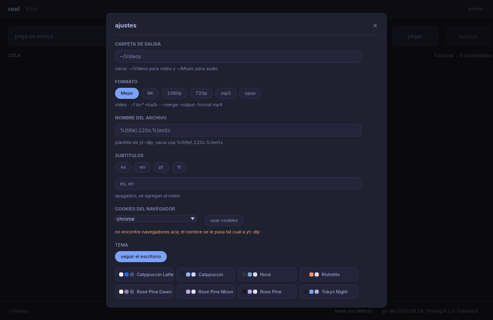

# Ajustes

`ajustes` arriba a la derecha (o `reel --settings`) abre el panel.
Escape, la cruz o un clic afuera lo cierran. Lo que elijas se guarda
en `~/.config/reel/settings.json` y sobrevive al cierre.

Los campos de texto se confirman al salir del campo o al cerrar, para
no validar una ruta a medio tipear.



## Carpeta de salida

Vacia: `~/Videos` para video y `~/Music` para audio, que es lo que
elige yt-dlp. Acepta `~` y `$HOME`. Si la carpeta no existe, es un
archivo o es de solo lectura, el panel lo dice.

## Formato

El mismo que en la ficha. El que dejas aca es el que arranca la
proxima vez, en vez de volver siempre a `Mejor`. Debajo ves si es
video o solo audio, y los flags que se le pasan a yt-dlp.

## Nombre del archivo

La plantilla de `-o`. Vacia usa `%(title).120s.%(ext)s`.

## Subtitulos

Los comunes (`es`, `en`, `pt`, `fr`) son un toque. Los demas se
escriben a mano como `de, it`, que termina en `--sub-langs`. Se
incrustan en el archivo. Vacio es apagado.

## Cookies del navegador

`--cookies-from-browser`, para contenido con sesion. La lista sale de
los navegadores que hay en la maquina; el combo muestra el que el
escritorio tiene por defecto. `usar cookies` lo enciende o lo apaga.

En la captura no habia perfiles de navegador en esa maquina, y el
panel lo dice en ambar. El nombre igual se le pasa a yt-dlp.

## Tema

`seguir el escritorio` usa Omarchy en vivo cuando esta. Si no, las
ocho paletas compartidas (Catppuccin, Nord, Ristretto, Rose Pine,
Tokyo Night, …) con una muestra de colores. La eleccion se recuerda.

En estas fotos no habia Omarchy, asi que el pie dice
`tema: por defecto`.

## Otras formas de mandar un enlace

Sin abrir la ficha:

```sh
reel --yoink "https://..."
```

Es el mismo camino que `Pegar y descargar` del tray: lee el enlace y
lo encola solo. Si reel ya esta abierto, la segunda copia le pasa el
pedido a la que corre y se va. Cerrar la ventana no mata la cola: vive
en el tray hasta que elijas `Salir`.

El menu del tray no se capturo aca (no habia bandeja en el entorno).
