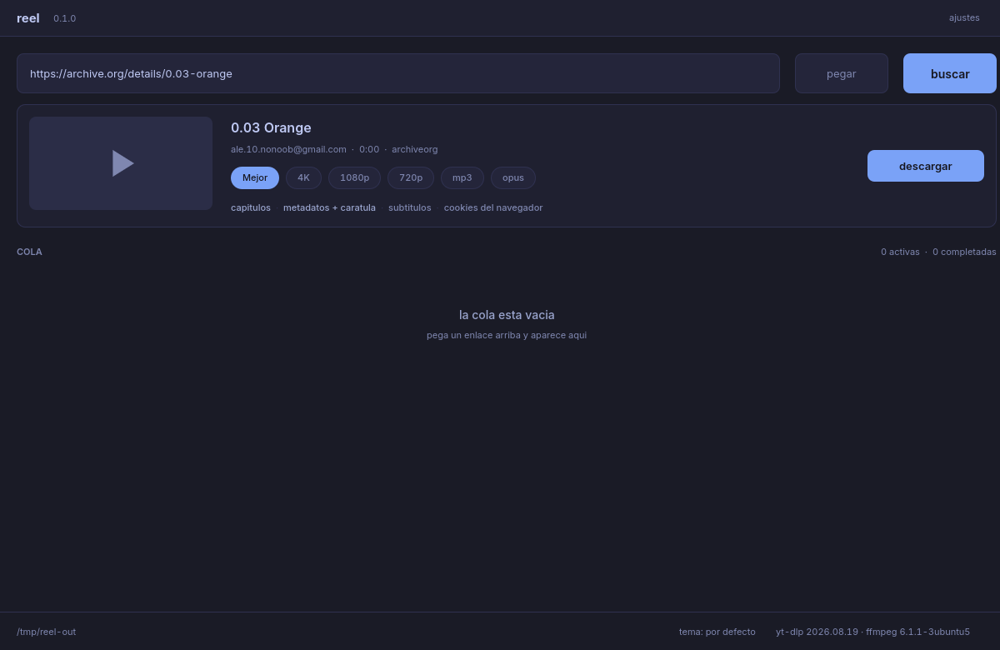

# Buscar y la ficha

Despues de `buscar`, reel pinta lo que encontro **antes** de bajar nada.
Asi podes elegir calidad, audio, o una lista, sin comprometerte.

## Que hay en la ficha

- Miniatura, si el sitio la sirve. Si no llega (o la url tiene un
  caracter que egui no traga), queda el triangulo de play. En esta
  captura paso eso: archive.org puso un espacio en la miniatura.
- Titulo, autor, duracion y el host (`archive.org`, YouTube, etc.).
- Pastillas de formato: `Mejor`, `4K`, `1080p`, `720p`, `mp3`, `opus`.
- Debajo, opciones: `capitulos`, `metadatos + caratula`, `subtitulos`,
  `cookies del navegador`. Encendidas se leen mas claras.
- A la derecha, `descargar`.

El formato que queda marcado es el mismo que en [ajustes](ajustes.md).
Si la ultima vez bajaste en `mp3`, arranca en `mp3`.

## Los formatos

| Formato | Que baja |
|---|---|
| `Mejor` | el mejor video con el mejor audio, en mp4 |
| `4K` / `1080p` / `720p` | lo mejor hasta esa altura, en mp4 |
| `mp3` | solo audio, extraido, calidad 0 |
| `opus` | solo audio, en opus |

`Mejor` y las alturas piden el mejor par de pistas y las unen con
ffmpeg. En YouTube suele ser av1 + opus: suena y se ve bien, pero no lo
abre cualquier tele vieja. Si te importa el reproductor, eligi `720p` o
baja en `mp3`.

Con audio, la carpeta por defecto pasa a `~/Music` (salvo que hayas
clavado otra en ajustes).

## Las opciones de la ficha

- **capitulos**: los incrusta. Solo aparece con formatos de video.
- **metadatos + caratula**: titulo, autor y miniatura dentro del archivo.
  Viene prendido.
- **subtitulos**: enciende o apaga el idioma `es`. El resto de idiomas
  se elige en ajustes.
- **cookies del navegador**: para contenido con sesion. El navegador se
  elige en ajustes.

## Listas

Si el enlace es una lista y no un video, la ficha lo dice
(`es una lista: 19 videos`) y el boton cambia a `encolar 19`.
`--no-playlist` **no** frena una url de lista: yt-dlp la baja entera.

Con **diez videos o mas**, el primer toque no encola: el boton pasa a
`confirmar 19` y el segundo toque manda. Con menos de diez, un toque
alcanza.

Al encolarla, la lista se parte en **una fila por video**. La fila de la
lista queda arriba como resumen. Si un video falla, los demas siguen.

No hay captura de una lista en estas guias: no se abrio un enlace de
playlist en la sesion de las fotos.

Cuando apretas `descargar`, el trabajo entra a [la cola](cola.md). La
ficha se queda, por si queres encolar otra calidad del mismo enlace.
